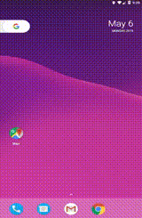

# Synopsis

Simple RPI cam viewer for Android meant to be used in conjunction with
the minimal [rpi cam server](https://github.com/hossfard/rpi-cam-server).



*Note*: this was originally written in 2017 and has since been
revisited.

# Requirements

* Android SDK (used 24, 26)
* Android NDK
* Qt (tried with 5.6+)
* openjdk 1.8
* openjdk-devel
* Android platform API (24)
* ~~Apache ANT 1.10.1~~
* Gradle (auto downloaded by `androiddeployqt`)
* C++11+ compliant compiler


See [android sdk, ndk, and Qt](#getting-started-with-android-and-avd)
section for notes on installing Android sdk/ndk and QT.

# Usage

[Compile](#compilation) and run the executable. Enter the server
information in the fields:
- `host`: Use either IP address of the host, or a URL of the host. If
  only an IP address is specified, defaults to HTTP and periodic image
  updates. If websocket protocol is specified
  e.g. `ws://<ip-address>`, streams video
- `username`: username for HTTP access
- `password`: password for HTTP access
- `WS Token`: authentication token sent to server on first connect to
  websocket. Only used when using the websocket protocol.

# Compilation

First, [download and install](#getting-started-with-android-and-avd)
QT and Android SDK and NDK. Then follow sections below.

## Android (x86)
1. Adjust paths under `env.sh`
2. Run `android_build.sh`

Note:
- if running for the first time and `gradle` does not exist on system
  path, then `androiddeployqt` will silently download `gradle` to
  `~/.gradle`. It's a larger file so may take a while.

## Android (arm)
1. Adjust paths under `env.sh`
2. Modify `android_build.sh` and change relevant entries to armv7
2. Run `android_build.sh`


## iOS

TODO

## Desktop (x86)

```bash
source env.sh gcc_64
qmake64
make clean
make
```

# Deploy to Android emulator

Start emulator, then push to device.

```bash
emulator -avd created-device-name -skin 540x960 # (or e.g. 1200x1920)
adb install -r PATH/TO/APK
```

# Getting started with Android and AVD

There were a lot of bugs originally when using Qt 5.6.2 e.g. blank
screen when starting apps in the android emulator.

1. Download the [Android SDK](https://developer.android.com/studio)

Only downloaded command-line tools (147MB zipped)
```bash
curl -O https://dl.google.com/android/repository/sdk-tools-linux-4333796.zip
unzip sdk-tools-linux-4333796.zip # unzips to `tool`
mkdir /opt/android/
mv tool /opt/android/sdk/
```

2. Download the [Android NDK](https://developer.android.com/ndk/downloads)

Direct download:
```bash
curl -O https://dl.google.com/android/repository/android-ndk-r19c-linux-x86_64.zip
unzip android-ndk-r19c-linux-x86_64.zip
mkdir /opt/android/ndk
mv android-ndk-r19c /opt/android/ndk
```

3. Download Qt (e.g. 5.12)

```bash
download-qt5.12.2-from-website # .run file
chmod u+x qt5.12.2.run
./qt5.12.2.run
mv-extracted-contents-to /opt/Qt/5.12.2
```

4. Install prerequisites

On OpenSUSE,

```bash
zypper in java-1_8_0-openjdk java-1_8_0-openjdk-devel
```

5. Create and/or download Android images and tools

- Download platform-tools, emulator, and system images
```bash
sdkmanager --list
sdkmanager "platform-tools" "platforms;android-25"
# Download system image files -- it's a big file, might take a while
sdkmanager "system-images;android-25;google_apis;x86"
sdkmanager "emulator"
```

- Create an android virtual device
```bash
avdmanager create avd \
    -name "insert-device-name-here-with-quotes" \
    --path path/to/device-image \
    -k "image-name"
```
where `image-name` may be e.g. `"system-images;android-25;google_apis;x86"`

Test emulator
```bash
emulator -avd created-device-name -skin 540x960 # (or e.g. 1200x1920)
```

Add keyboard support to the virtual device.

```bash
echo "hw.keyboard=yes" >> /path/to/device-avd-directory/config.ini
# E.g. path `~/.android/avd/mydevice.avd/config.ini`
```

6. Build QT application

Originally I tried using `cmake` but was greeted with a continuous
influx of errors which seemed to emanate from bugs and version
incompatiblities. After the 8th hour I gave up and settled for
`qmake`. It is possible that all the issues are fixed in the latest
versions of the toolkits, but I never revisited it.

Latest toolkits doesn't seem to work with `ant` anymore and must use
`gradle` instead.

```bash
qmake # (armv7, x86, etc depending on target platform)
BUILD_DIR=/some/path/for/build/directory
make
# will auto create directory if nonexistent
make install INSTALL_ROOT=$BUILD_DIR
androiddeployqt --output $BUILD_DIR \
    --input /path/to/qmake-json-output-file.json \
    --android-platform $ANDROID_API_PLATOFRM \
    --verbose \
    --gradle
```

Look under `ANDROID_NDK_ROOT/platforms` for valid
`$ANDROID_API_PLATORM`.

E.g.

```bash
qtdeploy_x86 --output ./build_and86/ \
   --input android-librpicamview.so-deployment-settings.json \
   --android-platform android-24 \
   --verbose \
   --gradle
```

If running for the first time, it will download and extract `gradle`
to `~/.gradle` (but for some reason it won't explicitly tell you this)

Note: this build process is simplified with the android
[build script](android_build.sh) file.

Pushing apks to emulator while the emulator is running:
```bash
adb install -r PATH/TO/file.apk
```

# TODO

- Better streamline builds for different platforms
